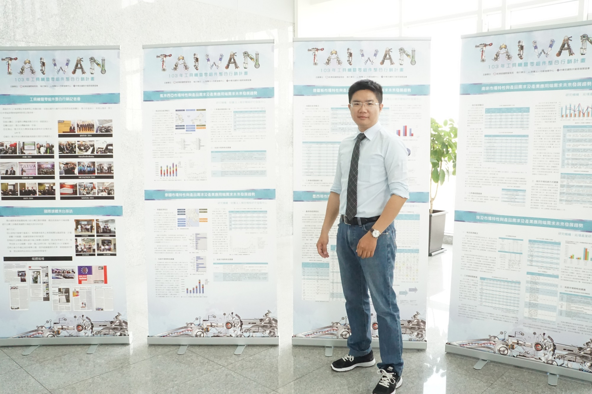

# Lincheng-CV_2025
您好，我叫林誠，是一位產業記者。這是我的一個基本的資料介紹。請多多指教。 
Hi, this is Lincheng. I am an industrial journalist. Here is my CV. Please take a look. 

<html>
    <head>
		<title>林誠CV
		Lincheng</title>
		<link rel="stylesheet" href="test0806.css">
		</head> 
		<body>
			
 
				<header class="xyz"> 
						

						<section class="aba">
							 
							<h4>林誠Lincheng</h4>
							
							<h4>個人履歷 RÉSUMÉ</h4>		 						
							
								<h6>Designed by Evon</h6>  
							</section>
							
							
						

				</header>
				

						<section class="abb">						
						<h2>林誠的個人網頁 
      						    Lincheng's Website</h2>
						
							<table>							

    <tr>
      <td style="text-align: center; vertical-align: middle; font-size: larger;">學歷 Education</td> 
        <td>
            <ul>
                <li>
                    碩士: 畢業_心理語言學、中國方言學研究 Master's: Graduated – Psycholinguistics, Chinese Dialectology Research
                </li>
                <li>
                    學士: 畢業_外語系 Bachelor's: Graduated – Department of Foreign Languages
                </li>
            </ul>
        </td>    
    </tr>

  <tr>
    <td style="text-align: center; vertical-align: middle; font-size: larger;">經歷 Experiece</td>
	<td>
	    <ul>
		<li>
		  媒體代理商_溝通與管理人員 2024-25 Media Agency_General Coordination & Support
		</li>
		<li>
	   	  聖僑資訊_專案經理 2016-23 S&J Corp._PM
	      	</li>  
		<li>
	   	  瑞士榮格集團_記者 2012-15 Ringier AG in China_Journalist
	      	</li>
		<ul>	
	</td>	
</tr>
										<tr>
											<td style="text-align: center; vertical-align: middle; font-size: larger;">專長領域 Expertise</td>
											<td><li>撰文</li>
												<li>文案編輯</li>
												<li>網站企劃</li>
												<li>專案管理</li>
												<li>國際事務溝通</li></td>
										</tr>
										<tr>
											<td style="text-align: center; vertical-align: middle; font-size: larger;">證照 Certificate</td>
											<td><li>全民英檢高級</li>
	   										<li>托福600分</li></td>	
										</tr>
	  									<tr>
											<td style="text-align: center; vertical-align: middle; font-size: larger;">語言能力 Language Proficiency</td>
											<td>    <li>中文_簡、繁體: 母語溝通、書寫</li>
	   											<li>中文_粵語、閩南語: 簡單溝通</li>
												<li>美式英語: 母語溝通、書寫</li>
												<li>德語: 簡單溝通</li>
												<li>現代希伯來語: 簡單溝通</li>
												<li>法語: 簡單溝通</li></td>
										</tr>
										<tr>
											<td style="text-align: center; vertical-align: middle; font-size: larger;">聯絡資訊 Contact Info</td>
											<td><li>電郵：<a href="mailto:#">lincheng4567@yahoo.com.tw</a></li>
											<li>手機：09XX-XXX XXX</li>
											</td>	
										</tr>
<tr>
											<td style="text-align: center; vertical-align: middle; font-size: larger;">個性特質 Personality</td>
											<td><li>休閒活動：睡覺、學習、運動</li>
											<li>個性特點: 內向害羞、不擅言詞</li>
											</td>	
										</tr>
											   
									</tbody>
								</table>
					
			
								<section>				
									
								<h2>我的作品</h2>
								

										

											<ol>
												<li>XXX (找TMTS 2024的資料收集) </li>
												<li>XXX (找YouTube BS網址) </li>
												<li>XXX (找播報磨床視頻) </li>
												<li>XXX (2017、15、13年TIMTOS 展會快報)</li>
												<li>XXX (找廠商文章)</li>
											</ol>
										

										

										
<iframe src="https://www.google.com/maps/embed?pb=!1m18!1m12!1m3!1d3094.999010331444!2d-84.35915692405203!3d39.12925397167547!2m3!1f0!2f0!3f0!3m2!1i1024!2i768!4f13.1!3m3!1m2!1s0x8841ab89b9d49753%3A0x25d68459912911a0!2zNjkxNSBWYWxsZXkgQXZlLCBDaW5jaW5uYXRpLCBPSCA0NTI0NOe-juWciw!5e0!3m2!1szh-TW!2stw!4v1735521861288!5m2!1szh-TW!2stw" width="600" height="450" style="border:0;" allowfullscreen="" loading="lazy" referrerpolicy="no-referrer-when-downgrade"></iframe> 
										

								</section>
					

					<section>
			
								
							

							

								<ul>
									
									<li>
										<h4>連絡電話</h4> 
										0937-470 012
									</li>
								</ul>
							

						

					</section>
					</section>	
				

				
				<footer>
				
				</footer>
		
		
			

		</body>

</html>
